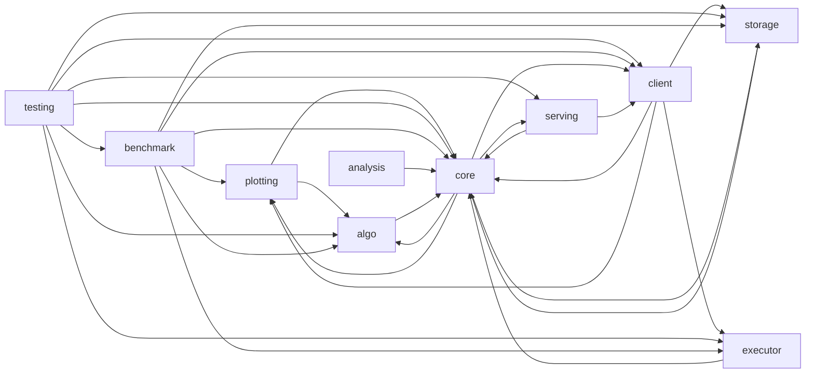

# Code Overview

[_Documentation generated by Documatic_](https://www.documatic.com)

<!---Documatic-section-Codebase Structure Python-start--->
## Codebase Structure Python

The codebase has a 3-deep folder structure,
                with 148 code files in total.

<!---Documatic-block-system_architecture-start--->

<!---Documatic-block-system_architecture-end--->

# #
<!---Documatic-section-Codebase Structure Python-end--->

<!---Documatic-section-Key Infrastructure-start--->
## Key Infrastructure

### MongoDB is used in:

* `read` of `src.orion.core.io.database.ephemeraldb.EphemeralDB`
* `read` of `src.orion.core.io.database.mongodb.MongoDB`
* `write` of `src.orion.core.io.database.mongodb.MongoDB`

# #
<!---Documatic-section-Key Infrastructure-end--->

<!---Documatic-section-Important Functions-start--->
## Important Functions

<!---Documatic-block-important_funcs-start--->
<!---Documatic-block-most_used_funcs-start--->
### Most Utilised Functions

* [src.orion.core.utils.flatten.flatten](6-src_orion_core.md#src.orion.core.utils.flatten.flatten) (16 times)
* [src.orion.core.utils.format_trials.dict_to_trial](6-src_orion_core.md#src.orion.core.utils.format_trials.dict_to_trial) (6 times)
* [src.orion.core.utils.flatten.unflatten](6-src_orion_core.md#src.orion.core.utils.flatten.unflatten) (6 times)
* [src.orion.core.worker.transformer.build_required_space](6-src_orion_core.md#src.orion.core.worker.transformer.build_required_space) (5 times)
* [src.orion.storage.base.setup_storage](5-src_orion_storage.md#src.orion.storage.base.setup_storage) (5 times)
* [src.orion.core.utils.pptree.print_tree](6-src_orion_core.md#src.orion.core.utils.pptree.print_tree) (4 times)
* src.orion.executor.base.executor_factory (3 times)
* src.orion.algo.parallel_strategy.strategy_factory (3 times)
* [src.orion.core.utils.terminal.confirm_name](6-src_orion_core.md#src.orion.core.utils.terminal.confirm_name) (3 times)
* [src.orion.serving.parameters.retrieve_experiment](8-src_orion_serving.md#src.orion.serving.parameters.retrieve_experiment) (3 times)
* [src.orion.client.__init__.create_experiment](4-src_orion_client.md#src.orion.client.__init__.create_experiment) (2 times)
* [src.orion.core.worker.primary_algo.create_algo](6-src_orion_core.md#src.orion.core.worker.primary_algo.create_algo) (2 times)
* [src.orion.core.worker.trial.validate_status](6-src_orion_core.md#src.orion.core.worker.trial.validate_status) (2 times)
* [src.orion.storage.base.get_uid](5-src_orion_storage.md#src.orion.storage.base.get_uid) (2 times)
* [src.orion.plotting.base.regrets](3-src_orion_plotting.md#src.orion.plotting.base.regrets) (2 times)
* [src.orion.core.io.convert.infer_converter_from_file_type](6-src_orion_core.md#src.orion.core.io.convert.infer_converter_from_file_type) (2 times)
* [src.orion.analysis.base.flatten_numpy](7-src_orion_analysis.md#src.orion.analysis.base.flatten_numpy) (2 times)
* [src.orion.analysis.base.to_numpy](7-src_orion_analysis.md#src.orion.analysis.base.to_numpy) (2 times)
* [src.orion.analysis.base.train_regressor](7-src_orion_analysis.md#src.orion.analysis.base.train_regressor) (2 times)
* [src.orion.serving.parameters.verify_query_parameters](8-src_orion_serving.md#src.orion.serving.parameters.verify_query_parameters) (2 times)
* [src.orion.core.utils.random_state.control_randomness](6-src_orion_core.md#src.orion.core.utils.random_state.control_randomness) (2 times)
* [src.orion.client.runner.prepare_trial_working_dir](4-src_orion_client.md#src.orion.client.runner.prepare_trial_working_dir) (1 times)
* [src.orion.client.cli.interrupt_trial](4-src_orion_client.md#src.orion.client.cli.interrupt_trial) (1 times)
* [src.orion.client.cli.report_bad_trial](4-src_orion_client.md#src.orion.client.cli.report_bad_trial) (1 times)
* [src.orion.client.cli.report_objective](4-src_orion_client.md#src.orion.client.cli.report_objective) (1 times)
<!---Documatic-block-most_used_funcs-end--->
<!---Documatic-block-important_funcs-end--->

# #
<!---Documatic-section-Important Functions-end--->

<!---Documatic-section-File IO-start--->
## File IO

<!---Documatic-block-file_io-start--->
The following files have file read operations

<!---Documatic-block-src.orion-start--->

	
<code>src.orion</code> (Click to Expand!)

* src.orion.benchmark.task.profet.model_utils
* src.orion.core._version
* src.orion.core.cli.frontend
* src.orion.core.io.config
* src.orion.core.io.convert
* src.orion.core.io.database.pickleddb
* src.orion.testing.state

<!---Documatic-block-src.orion-end--->

The following files have file write operations

<!---Documatic-block-src.orion-start--->

	
<code>src.orion</code> (Click to Expand!)

* src.orion.benchmark.task.profet.model_utils
* src.orion.client.cli
* src.orion.core.cli.db.setup
* src.orion.core.cli.plot
* src.orion.core.io.convert
* src.orion.core.io.database.pickleddb
* src.orion.storage.track

<!---Documatic-block-src.orion-end--->
<!---Documatic-block-file_io-end--->

# #
<!---Documatic-section-File IO-end--->

<!---Documatic-section-Class Hierarchy-start--->
## Class Hierarchy

<!---Documatic-block-src.orion.benchmark.task.profet.profet_task.ProfetTask-start--->

	
<code>src.orion.benchmark.task.profet.profet_task.ProfetTask</code> (Click to Expand!)

* src.orion.benchmark.task.profet.fcnet.ProfetFcNetTask
* src.orion.benchmark.task.profet.forrester.ProfetForresterTask
* src.orion.benchmark.task.profet.svm.ProfetSvmTask
* src.orion.benchmark.task.profet.xgboost.ProfetXgBoostTask

<!---Documatic-block-src.orion.benchmark.task.profet.profet_task.ProfetTask-end--->

<!---Documatic-block-src.orion.core.io.database.__init__.OutdatedDatabaseError-start--->

	
<code>src.orion.core.io.database.__init__.OutdatedDatabaseError</code> (Click to Expand!)

* src.orion.core.io.database.__init__.DatabaseTimeout
* src.orion.core.io.database.__init__.DuplicateKeyError
* src.orion.core.io.database.__init__.OutdatedDatabaseError

<!---Documatic-block-src.orion.core.io.database.__init__.OutdatedDatabaseError-end--->

<!---Documatic-block-src.orion.core.worker.transformer.TransformedSpace-start--->

	
<code>src.orion.core.worker.transformer.TransformedSpace</code> (Click to Expand!)

* src.orion.core.worker.transformer.ReshapedSpace
* src.orion.core.worker.transformer.TransformedSpace

<!---Documatic-block-src.orion.core.worker.transformer.TransformedSpace-end--->

# #
<!---Documatic-section-Class Hierarchy-end--->

[_Documentation generated by Documatic_](https://www.documatic.com)