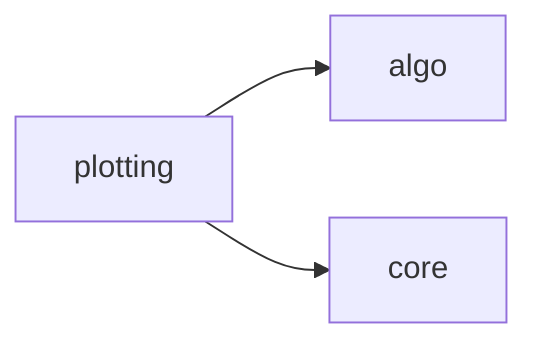

# Src Orion Plotting

[_Documentation generated by Documatic_](https://www.documatic.com)

<!---Documatic-section-Codebase Structure-start--->
## Codebase Structure

<!---Documatic-block-system_architecture-start--->

<!---Documatic-block-system_architecture-end--->

# #
<!---Documatic-section-Codebase Structure-end--->

<!---Documatic-section-src.orion.plotting.base.regrets-start--->
## [src.orion.plotting.base.regrets](3-src_orion_plotting.md#src.orion.plotting.base.regrets)

<!---Documatic-section-regrets-start--->
<!---Documatic-block-src.orion.plotting.base.regrets-start--->
<details>
	<summary><code>src.orion.plotting.base.regrets</code> code snippet</summary>

```python
def regrets(experiments, with_evc_tree=True, order_by='suggested', **kwargs):
    return backend.regrets(experiments, with_evc_tree=with_evc_tree, order_by=order_by, build_frame_fn=backend.build_regrets_frame, return_var=True)
```
</details>
<!---Documatic-block-src.orion.plotting.base.regrets-end--->
<!---Documatic-section-regrets-end--->

# #
<!---Documatic-section-src.orion.plotting.base.regrets-end--->

[_Documentation generated by Documatic_](https://www.documatic.com)