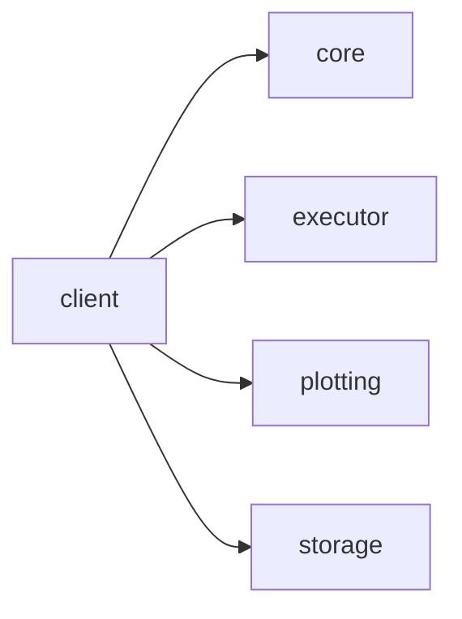
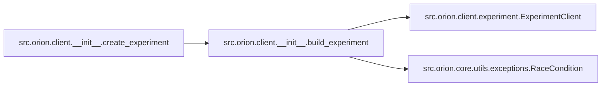
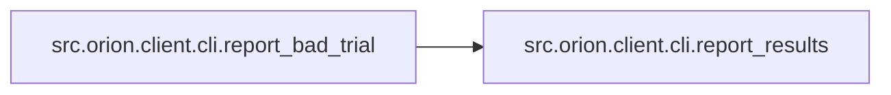
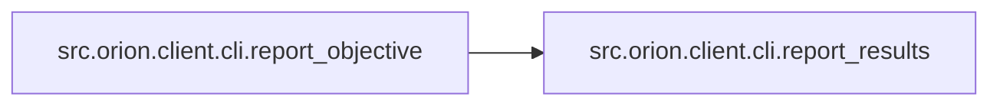
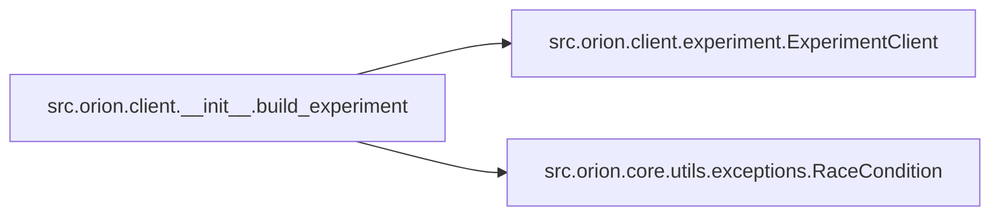

# Src Orion Client

[_Documentation generated by Documatic_](https://www.documatic.com)

<!---Documatic-section-Codebase Structure-start--->
## Codebase Structure

<!---Documatic-block-system_architecture-start--->

<!---Documatic-block-system_architecture-end--->

# #
<!---Documatic-section-Codebase Structure-end--->

<!---Documatic-section-src.orion.client.__init__.create_experiment-start--->
## [src.orion.client.__init__.create_experiment](4-src_orion_client.md#src.orion.client.__init__.create_experiment)

<!---Documatic-section-create_experiment-start--->


### Object Calls

* [src.orion.client.__init__.build_experiment](4-src_orion_client.md#src.orion.client.__init__.build_experiment)

<!---Documatic-block-src.orion.client.__init__.create_experiment-start--->
<details>
	<summary><code>src.orion.client.__init__.create_experiment</code> code snippet</summary>

```python
def create_experiment(name, **config):
    return build_experiment(name, **config)
```
</details>
<!---Documatic-block-src.orion.client.__init__.create_experiment-end--->
<!---Documatic-section-create_experiment-end--->

# #
<!---Documatic-section-src.orion.client.__init__.create_experiment-end--->

<!---Documatic-section-src.orion.client.runner.prepare_trial_working_dir-start--->
## [src.orion.client.runner.prepare_trial_working_dir](4-src_orion_client.md#src.orion.client.runner.prepare_trial_working_dir)

<!---Documatic-section-prepare_trial_working_dir-start--->
<!---Documatic-block-src.orion.client.runner.prepare_trial_working_dir-start--->
<details>
	<summary><code>src.orion.client.runner.prepare_trial_working_dir</code> code snippet</summary>

```python
def prepare_trial_working_dir(experiment_client: ExperimentClient, trial: Trial) -> None:
    backward.ensure_trial_working_dir(experiment_client, trial)
    if os.path.exists(trial.working_dir):
        return
    if trial.parent:
        parent_trial = experiment_client.get_trial(uid=trial.parent)
        if parent_trial is None:
            raise ValueError(f'Parent id {trial.parent} not available in storage. (From trial {trial.id})')
        shutil.copytree(parent_trial.working_dir, trial.working_dir)
    else:
        os.makedirs(trial.working_dir)
```
</details>
<!---Documatic-block-src.orion.client.runner.prepare_trial_working_dir-end--->
<!---Documatic-section-prepare_trial_working_dir-end--->

# #
<!---Documatic-section-src.orion.client.runner.prepare_trial_working_dir-end--->

<!---Documatic-section-src.orion.client.cli.interrupt_trial-start--->
## [src.orion.client.cli.interrupt_trial](4-src_orion_client.md#src.orion.client.cli.interrupt_trial)

<!---Documatic-section-interrupt_trial-start--->
<!---Documatic-block-src.orion.client.cli.interrupt_trial-start--->
<details>
	<summary><code>src.orion.client.cli.interrupt_trial</code> code snippet</summary>

```python
def interrupt_trial():
    sys.exit(config.worker.interrupt_signal_code)
```
</details>
<!---Documatic-block-src.orion.client.cli.interrupt_trial-end--->
<!---Documatic-section-interrupt_trial-end--->

# #
<!---Documatic-section-src.orion.client.cli.interrupt_trial-end--->

<!---Documatic-section-src.orion.client.cli.report_bad_trial-start--->
## [src.orion.client.cli.report_bad_trial](4-src_orion_client.md#src.orion.client.cli.report_bad_trial)

<!---Documatic-section-report_bad_trial-start--->


### Object Calls

* [src.orion.client.cli.report_results](4-src_orion_client.md#src.orion.client.cli.report_results)

<!---Documatic-block-src.orion.client.cli.report_bad_trial-start--->
<details>
	<summary><code>src.orion.client.cli.report_bad_trial</code> code snippet</summary>

```python
def report_bad_trial(objective=10000000000.0, name='objective', data=None):
    if data is None:
        data = []
    report_results([dict(name=name, type='objective', value=objective)] + data)
```
</details>
<!---Documatic-block-src.orion.client.cli.report_bad_trial-end--->
<!---Documatic-section-report_bad_trial-end--->

# #
<!---Documatic-section-src.orion.client.cli.report_bad_trial-end--->

<!---Documatic-section-src.orion.client.cli.report_objective-start--->
## [src.orion.client.cli.report_objective](4-src_orion_client.md#src.orion.client.cli.report_objective)

<!---Documatic-section-report_objective-start--->


### Object Calls

* [src.orion.client.cli.report_results](4-src_orion_client.md#src.orion.client.cli.report_results)

<!---Documatic-block-src.orion.client.cli.report_objective-start--->
<details>
	<summary><code>src.orion.client.cli.report_objective</code> code snippet</summary>

```python
def report_objective(objective, name='objective'):
    report_results([dict(name=name, type='objective', value=objective)])
```
</details>
<!---Documatic-block-src.orion.client.cli.report_objective-end--->
<!---Documatic-section-report_objective-end--->

# #
<!---Documatic-section-src.orion.client.cli.report_objective-end--->

<!---Documatic-section-src.orion.client.__init__.build_experiment-start--->
## [src.orion.client.__init__.build_experiment](4-src_orion_client.md#src.orion.client.__init__.build_experiment)

<!---Documatic-section-build_experiment-start--->


### Object Calls

* src.orion.client.experiment.ExperimentClient
* src.orion.core.utils.exceptions.RaceCondition

<!---Documatic-block-src.orion.client.__init__.build_experiment-start--->
<details>
	<summary><code>src.orion.client.__init__.build_experiment</code> code snippet</summary>

```python
def build_experiment(name, version=None, space=None, algorithms=None, strategy=None, max_trials=None, max_broken=None, storage=None, branching=None, max_idle_time=None, heartbeat=None, working_dir=None, debug=False, executor=None):
    if max_idle_time:
        log.warning('max_idle_time is deprecated. Use experiment.workon(reservation_timeout) instead.')
    builder = experiment_builder.ExperimentBuilder(storage, debug)
    try:
        experiment = builder.build(name, version=version, space=space, algorithms=algorithms, strategy=strategy, max_trials=max_trials, max_broken=max_broken, branching=branching, working_dir=working_dir)
    except RaceCondition:
        try:
            experiment = builder.build(name, version=version, space=space, algorithms=algorithms, strategy=strategy, max_trials=max_trials, max_broken=max_broken, branching=branching, working_dir=working_dir)
        except RaceCondition as e:
            raise RaceCondition('There was a race condition during branching and new version cannot be inferred because of that. Single race conditions are normally handled seamlessly. If this error gets raised, it means that different modifications occurred during each race condition resolution. This is likely due to quick code change during experiment creation. Make sure your script is not generating files within your code repository.') from e
    return ExperimentClient(experiment, executor, heartbeat)
```
</details>
<!---Documatic-block-src.orion.client.__init__.build_experiment-end--->
<!---Documatic-section-build_experiment-end--->

# #
<!---Documatic-section-src.orion.client.__init__.build_experiment-end--->

<!---Documatic-section-src.orion.client.cli.report_results-start--->
## [src.orion.client.cli.report_results](4-src_orion_client.md#src.orion.client.cli.report_results)

<!---Documatic-section-report_results-start--->
<!---Documatic-block-src.orion.client.cli.report_results-start--->
<details>
	<summary><code>src.orion.client.cli.report_results</code> code snippet</summary>

```python
def report_results(data):
    global _HAS_REPORTED_RESULTS
    if _HAS_REPORTED_RESULTS:
        raise RuntimeWarning('Has already reported evaluation results once.')
    if IS_ORION_ON:
        with open(RESULTS_FILENAME, 'w', encoding='utf8') as results_file:
            json.dump(data, results_file)
    else:
        print(data)
    _HAS_REPORTED_RESULTS = True
```
</details>
<!---Documatic-block-src.orion.client.cli.report_results-end--->
<!---Documatic-section-report_results-end--->

# #
<!---Documatic-section-src.orion.client.cli.report_results-end--->

[_Documentation generated by Documatic_](https://www.documatic.com)