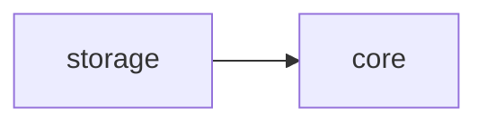
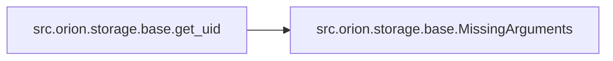

# Src Orion Storage

[_Documentation generated by Documatic_](https://www.documatic.com)

<!---Documatic-section-Codebase Structure-start--->
## Codebase Structure

<!---Documatic-block-system_architecture-start--->

<!---Documatic-block-system_architecture-end--->

# #
<!---Documatic-section-Codebase Structure-end--->

<!---Documatic-section-src.orion.storage.base.setup_storage-start--->
## [src.orion.storage.base.setup_storage](5-src_orion_storage.md#src.orion.storage.base.setup_storage)

<!---Documatic-section-setup_storage-start--->
<!---Documatic-block-src.orion.storage.base.setup_storage-start--->
<details>
	<summary><code>src.orion.storage.base.setup_storage</code> code snippet</summary>

```python
def setup_storage(storage=None, debug=False):
    if storage is None:
        storage = orion.core.config.storage.to_dict()
    storage = copy.deepcopy(storage)
    if storage.get('type') == 'legacy' and 'database' not in storage:
        storage['database'] = orion.core.config.storage.database.to_dict()
    elif storage.get('type') is None and 'database' in storage:
        storage['type'] = 'legacy'
    if storage['type'] == orion.core.config.storage.type:
        storage = resolve_config.merge_configs(orion.core.config.storage.to_dict(), storage)
    if debug:
        storage = {'type': 'legacy', 'database': {'type': 'EphemeralDB'}}
    storage_type = storage.pop('type')
    log.debug('Creating %s storage client with args: %s', storage_type, storage)
    try:
        return storage_factory.create(of_type=storage_type, **storage)
    except ValueError:
        if storage_factory.create().__class__.__name__.lower() != storage_type.lower():
            raise
```
</details>
<!---Documatic-block-src.orion.storage.base.setup_storage-end--->
<!---Documatic-section-setup_storage-end--->

# #
<!---Documatic-section-src.orion.storage.base.setup_storage-end--->

<!---Documatic-section-src.orion.storage.base.get_uid-start--->
## [src.orion.storage.base.get_uid](5-src_orion_storage.md#src.orion.storage.base.get_uid)

<!---Documatic-section-get_uid-start--->


### Object Calls

* [src.orion.storage.base.MissingArguments](5-src_orion_storage.md#src.orion.storage.base.MissingArguments)

<!---Documatic-block-src.orion.storage.base.get_uid-start--->
<details>
	<summary><code>src.orion.storage.base.get_uid</code> code snippet</summary>

```python
def get_uid(item=None, uid=None, force_uid=True):
    if item is not None and uid is not None:
        assert item.id == uid
    if uid is None:
        if item is None and force_uid:
            raise MissingArguments('Either `item` or `uid` should be set')
        elif item is not None:
            uid = item.id
    return uid
```
</details>
<!---Documatic-block-src.orion.storage.base.get_uid-end--->
<!---Documatic-section-get_uid-end--->

# #
<!---Documatic-section-src.orion.storage.base.get_uid-end--->

<!---Documatic-section-src.orion.storage.base.MissingArguments-start--->
## [src.orion.storage.base.MissingArguments](5-src_orion_storage.md#src.orion.storage.base.MissingArguments)

<!---Documatic-section-MissingArguments-start--->
<!---Documatic-block-src.orion.storage.base.MissingArguments-start--->
<details>
	<summary><code>src.orion.storage.base.MissingArguments</code> code snippet</summary>

```python
class MissingArguments(Exception):
```
</details>
<!---Documatic-block-src.orion.storage.base.MissingArguments-end--->
<!---Documatic-section-MissingArguments-end--->

# #
<!---Documatic-section-src.orion.storage.base.MissingArguments-end--->

[_Documentation generated by Documatic_](https://www.documatic.com)