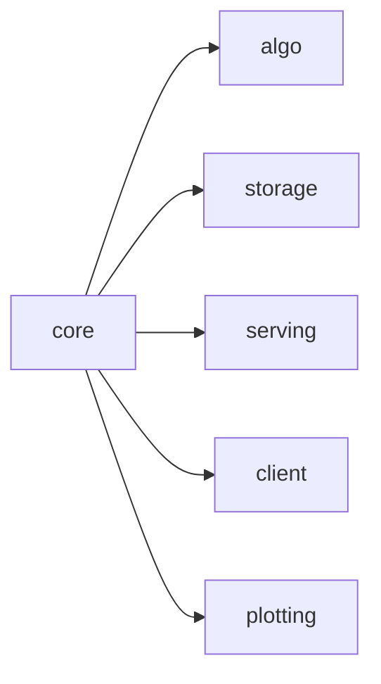
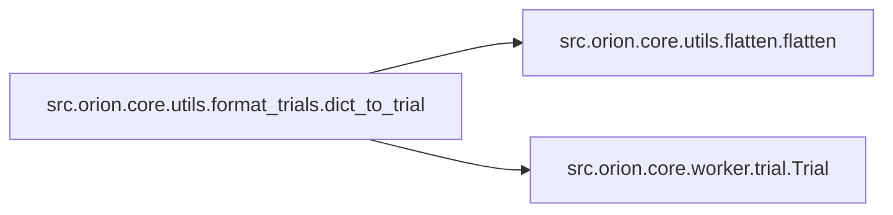
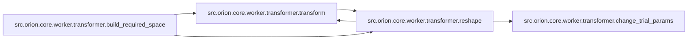
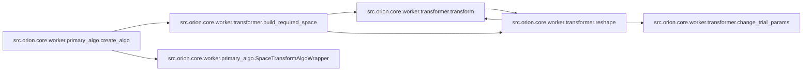
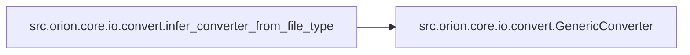
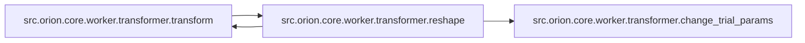
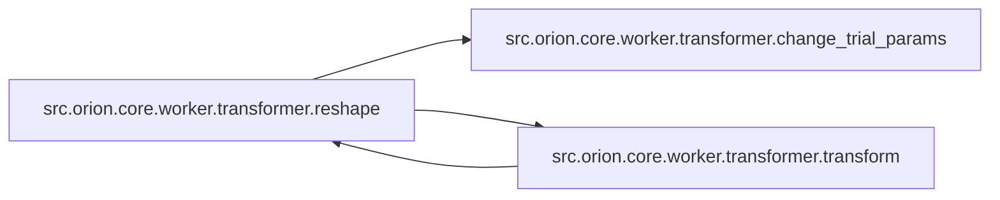

# Src Orion Core

[_Documentation generated by Documatic_](https://www.documatic.com)

<!---Documatic-section-Codebase Structure-start--->
## Codebase Structure

<!---Documatic-block-system_architecture-start--->

<!---Documatic-block-system_architecture-end--->

# #
<!---Documatic-section-Codebase Structure-end--->

<!---Documatic-section-src.orion.core.utils.flatten.flatten-start--->
## [src.orion.core.utils.flatten.flatten](6-src_orion_core.md#src.orion.core.utils.flatten.flatten)

<!---Documatic-section-flatten-start--->
<!---Documatic-block-src.orion.core.utils.flatten.flatten-start--->
<details>
	<summary><code>src.orion.core.utils.flatten.flatten</code> code snippet</summary>

```python
def flatten(dictionary):

    def _flatten(dictionary):
        if dictionary == {}:
            return dictionary
        (key, value) = dictionary.popitem()
        if not isinstance(value, dict) or not value:
            new_dictionary = {key: value}
            new_dictionary.update(flatten(dictionary))
            return new_dictionary
        flat_sub_dictionary = flatten(value)
        for flat_sub_key in list(flat_sub_dictionary.keys()):
            flat_key = key + '.' + flat_sub_key
            flat_sub_dictionary[flat_key] = flat_sub_dictionary.pop(flat_sub_key)
        new_dictionary = flat_sub_dictionary
        new_dictionary.update(flatten(dictionary))
        return new_dictionary
    return _flatten(copy.deepcopy(dictionary))
```
</details>
<!---Documatic-block-src.orion.core.utils.flatten.flatten-end--->
<!---Documatic-section-flatten-end--->

# #
<!---Documatic-section-src.orion.core.utils.flatten.flatten-end--->

<!---Documatic-section-src.orion.core.utils.format_trials.dict_to_trial-start--->
## [src.orion.core.utils.format_trials.dict_to_trial](6-src_orion_core.md#src.orion.core.utils.format_trials.dict_to_trial)

<!---Documatic-section-dict_to_trial-start--->


### Object Calls

* [src.orion.core.utils.flatten.flatten](6-src_orion_core.md#src.orion.core.utils.flatten.flatten)
* [src.orion.core.worker.trial.Trial](6-src_orion_core.md#src.orion.core.worker.trial.Trial)

<!---Documatic-block-src.orion.core.utils.format_trials.dict_to_trial-start--->
<details>
	<summary><code>src.orion.core.utils.format_trials.dict_to_trial</code> code snippet</summary>

```python
def dict_to_trial(data, space):
    data = flatten(data)
    params = []
    for (name, dim) in space.items():
        if name not in data and dim.default_value is dim.NO_DEFAULT_VALUE:
            raise ValueError(f'Dimension {name} not specified and does not have a default value.')
        value = data.get(name, dim.default_value)
        params.append(dict(name=dim.name, type=dim.type, value=value))
    trial = Trial(params=params)
    if trial not in space:
        error_msg = f'Parameters values {trial.params} are outside of space {space}'
        raise ValueError(error_msg)
    return trial
```
</details>
<!---Documatic-block-src.orion.core.utils.format_trials.dict_to_trial-end--->
<!---Documatic-section-dict_to_trial-end--->

# #
<!---Documatic-section-src.orion.core.utils.format_trials.dict_to_trial-end--->

<!---Documatic-section-src.orion.core.utils.flatten.unflatten-start--->
## [src.orion.core.utils.flatten.unflatten](6-src_orion_core.md#src.orion.core.utils.flatten.unflatten)

<!---Documatic-section-unflatten-start--->
<!---Documatic-block-src.orion.core.utils.flatten.unflatten-start--->
<details>
	<summary><code>src.orion.core.utils.flatten.unflatten</code> code snippet</summary>

```python
def unflatten(dictionary):
    unflattened_dictionary = {}
    for (key, value) in dictionary.items():
        parts = key.split('.')
        sub_dictionary = unflattened_dictionary
        for part in parts[:-1]:
            if part not in sub_dictionary:
                sub_dictionary[part] = {}
            sub_dictionary = sub_dictionary[part]
        sub_dictionary[parts[-1]] = value
    return unflattened_dictionary
```
</details>
<!---Documatic-block-src.orion.core.utils.flatten.unflatten-end--->
<!---Documatic-section-unflatten-end--->

# #
<!---Documatic-section-src.orion.core.utils.flatten.unflatten-end--->

<!---Documatic-section-src.orion.core.worker.transformer.build_required_space-start--->
## [src.orion.core.worker.transformer.build_required_space](6-src_orion_core.md#src.orion.core.worker.transformer.build_required_space)

<!---Documatic-section-build_required_space-start--->


### Object Calls

* [src.orion.core.worker.transformer.transform](6-src_orion_core.md#src.orion.core.worker.transformer.transform)
* [src.orion.core.worker.transformer.reshape](6-src_orion_core.md#src.orion.core.worker.transformer.reshape)

<!---Documatic-block-src.orion.core.worker.transformer.build_required_space-start--->
<details>
	<summary><code>src.orion.core.worker.transformer.build_required_space</code> code snippet</summary>

```python
def build_required_space(original_space, type_requirement=None, shape_requirement=None, dist_requirement=None):
    space = transform(original_space, type_requirement, dist_requirement)
    space = reshape(space, shape_requirement)
    return space
```
</details>
<!---Documatic-block-src.orion.core.worker.transformer.build_required_space-end--->
<!---Documatic-section-build_required_space-end--->

# #
<!---Documatic-section-src.orion.core.worker.transformer.build_required_space-end--->

<!---Documatic-section-src.orion.core.utils.pptree.print_tree-start--->
## [src.orion.core.utils.pptree.print_tree](6-src_orion_core.md#src.orion.core.utils.pptree.print_tree)

<!---Documatic-section-print_tree-start--->
<!---Documatic-block-src.orion.core.utils.pptree.print_tree-start--->
<details>
	<summary><code>src.orion.core.utils.pptree.print_tree</code> code snippet</summary>

```python
def print_tree(current_node, childattr='children', nameattr='name', indent='', last='updown'):
    if hasattr(current_node, nameattr):
        name = lambda node: getattr(node, nameattr)
    else:
        name = lambda node: str(node)
    children = lambda node: getattr(node, childattr)
    nb_children = lambda node: sum((nb_children(child) for child in children(node))) + 1
    size_branch = {child: nb_children(child) for child in children(current_node)}
    ' Creation of balanced lists for "up" branch and "down" branch. '
    up = sorted(children(current_node), key=lambda node: nb_children(node))
    down = []
    while up and sum((size_branch[node] for node in down)) < sum((size_branch[node] for node in up)):
        down.append(up.pop())
    ' Printing of "up" branch. '
    for child in up:
        next_last = 'up' if up.index(child) == 0 else ''
        next_indent = '{}{}{}'.format(indent, ' ' if 'up' in last else '│', ' ' * len(name(current_node)))
        print_tree(child, childattr, nameattr, next_indent, next_last)
    ' Printing of current node. '
    if last == 'up':
        start_shape = '┌'
    elif last == 'down':
        start_shape = '└'
    elif last == 'updown':
        start_shape = ' '
    else:
        start_shape = '├'
    if up:
        end_shape = '┤'
    elif down:
        end_shape = '┐'
    else:
        end_shape = ''
    print(f'{indent}{start_shape}{name(current_node)}{end_shape}')
    ' Printing of "down" branch. '
    for child in down:
        next_last = 'down' if down.index(child) is len(down) - 1 else ''
        next_indent = '{}{}{}'.format(indent, ' ' if 'down' in last else '│', ' ' * len(name(current_node)))
        print_tree(child, childattr, nameattr, next_indent, next_last)
```
</details>
<!---Documatic-block-src.orion.core.utils.pptree.print_tree-end--->
<!---Documatic-section-print_tree-end--->

# #
<!---Documatic-section-src.orion.core.utils.pptree.print_tree-end--->

<!---Documatic-section-src.orion.core.utils.terminal.confirm_name-start--->
## [src.orion.core.utils.terminal.confirm_name](6-src_orion_core.md#src.orion.core.utils.terminal.confirm_name)

<!---Documatic-section-confirm_name-start--->
<!---Documatic-block-src.orion.core.utils.terminal.confirm_name-start--->
<details>
	<summary><code>src.orion.core.utils.terminal.confirm_name</code> code snippet</summary>

```python
def confirm_name(message, name, force=False):
    if force:
        print(message)
        print('FORCED')
        return True
    answer = input(message)
    return answer.strip() == name
```
</details>
<!---Documatic-block-src.orion.core.utils.terminal.confirm_name-end--->
<!---Documatic-section-confirm_name-end--->

# #
<!---Documatic-section-src.orion.core.utils.terminal.confirm_name-end--->

<!---Documatic-section-src.orion.core.worker.primary_algo.create_algo-start--->
## [src.orion.core.worker.primary_algo.create_algo](6-src_orion_core.md#src.orion.core.worker.primary_algo.create_algo)

<!---Documatic-section-create_algo-start--->


### Object Calls

* [src.orion.core.worker.transformer.build_required_space](6-src_orion_core.md#src.orion.core.worker.transformer.build_required_space)
* [src.orion.core.worker.primary_algo.SpaceTransformAlgoWrapper](6-src_orion_core.md#src.orion.core.worker.primary_algo.SpaceTransformAlgoWrapper)

<!---Documatic-block-src.orion.core.worker.primary_algo.create_algo-start--->
<details>
	<summary><code>src.orion.core.worker.primary_algo.create_algo</code> code snippet</summary>

```python
def create_algo(algo_type: type[AlgoT], space: Space, **algo_kwargs) -> SpaceTransformAlgoWrapper[AlgoT]:
    original_space = space
    from orion.core.worker.transformer import build_required_space
    transformed_space = build_required_space(space, type_requirement=algo_type.requires_type, shape_requirement=algo_type.requires_shape, dist_requirement=algo_type.requires_dist)
    algorithm = algo_type(transformed_space, **algo_kwargs)
    wrapped_algo = SpaceTransformAlgoWrapper(algorithm=algorithm, space=original_space)
    return wrapped_algo
```
</details>
<!---Documatic-block-src.orion.core.worker.primary_algo.create_algo-end--->
<!---Documatic-section-create_algo-end--->

# #
<!---Documatic-section-src.orion.core.worker.primary_algo.create_algo-end--->

<!---Documatic-section-src.orion.core.worker.trial.validate_status-start--->
## [src.orion.core.worker.trial.validate_status](6-src_orion_core.md#src.orion.core.worker.trial.validate_status)

<!---Documatic-section-validate_status-start--->
<!---Documatic-block-src.orion.core.worker.trial.validate_status-start--->
<details>
	<summary><code>src.orion.core.worker.trial.validate_status</code> code snippet</summary>

```python
def validate_status(status):
    if status is not None and status not in Trial.allowed_stati:
        raise ValueError(f'Given status `{status}` not one of: {Trial.allowed_stati}')
```
</details>
<!---Documatic-block-src.orion.core.worker.trial.validate_status-end--->
<!---Documatic-section-validate_status-end--->

# #
<!---Documatic-section-src.orion.core.worker.trial.validate_status-end--->

<!---Documatic-section-src.orion.core.io.convert.infer_converter_from_file_type-start--->
## [src.orion.core.io.convert.infer_converter_from_file_type](6-src_orion_core.md#src.orion.core.io.convert.infer_converter_from_file_type)

<!---Documatic-section-infer_converter_from_file_type-start--->


### Object Calls

* [src.orion.core.io.convert.GenericConverter](6-src_orion_core.md#src.orion.core.io.convert.GenericConverter)

<!---Documatic-block-src.orion.core.io.convert.infer_converter_from_file_type-start--->
<details>
	<summary><code>src.orion.core.io.convert.infer_converter_from_file_type</code> code snippet</summary>

```python
def infer_converter_from_file_type(config_path, regex=None, default_keyword=''):
    (_, ext_type) = os.path.splitext(os.path.abspath(config_path))
    for klass in config_converter_factory.get_classes().values():
        if ext_type in klass.file_extensions:
            return klass()
    if regex is None:
        return GenericConverter(expression_prefix=default_keyword)
    return GenericConverter(regex, expression_prefix=default_keyword)
```
</details>
<!---Documatic-block-src.orion.core.io.convert.infer_converter_from_file_type-end--->
<!---Documatic-section-infer_converter_from_file_type-end--->

# #
<!---Documatic-section-src.orion.core.io.convert.infer_converter_from_file_type-end--->

<!---Documatic-section-src.orion.core.utils.random_state.control_randomness-start--->
## [src.orion.core.utils.random_state.control_randomness](6-src_orion_core.md#src.orion.core.utils.random_state.control_randomness)

<!---Documatic-section-control_randomness-start--->
<!---Documatic-block-src.orion.core.utils.random_state.control_randomness-start--->
<details>
	<summary><code>src.orion.core.utils.random_state.control_randomness</code> code snippet</summary>

```python
@contextmanager
def control_randomness(has_random_state: HasRandomState):
    if has_random_state.random_state is None:
        yield
        return
    initial_rng_state = RandomState.current()
    has_random_state.random_state.set()
    yield
    has_random_state.random_state = RandomState.current()
    initial_rng_state.set()
```
</details>
<!---Documatic-block-src.orion.core.utils.random_state.control_randomness-end--->
<!---Documatic-section-control_randomness-end--->

# #
<!---Documatic-section-src.orion.core.utils.random_state.control_randomness-end--->

<!---Documatic-section-src.orion.core.worker.primary_algo.SpaceTransformAlgoWrapper-start--->
## [src.orion.core.worker.primary_algo.SpaceTransformAlgoWrapper](6-src_orion_core.md#src.orion.core.worker.primary_algo.SpaceTransformAlgoWrapper)

<!---Documatic-section-SpaceTransformAlgoWrapper-start--->
<!---Documatic-block-src.orion.core.worker.primary_algo.SpaceTransformAlgoWrapper-start--->
<details>
	<summary><code>src.orion.core.worker.primary_algo.SpaceTransformAlgoWrapper</code> code snippet</summary>

```python
class SpaceTransformAlgoWrapper(BaseAlgorithm, Generic[AlgoT]):

    def __init__(self, space: Space, algorithm: AlgoT):
        super().__init__(space=space)
        self.algorithm: AlgoT = algorithm
        self.registry = Registry()
        self.registry_mapping = RegistryMapping(original_registry=self.registry, transformed_registry=self.algorithm.registry)
        self.max_suggest_attempts = 100

    @property
    def original_space(self) -> Space:
        """The original space (before transformations).
        This is exposed to the outside, but not to the wrapped algorithm.
        """
        return self._space

    @property
    def transformed_space(self) -> TransformedSpace:
        """The transformed space (after transformations).
        This is only exposed to the wrapped algo, not to classes outside of this.
        """
        return self.algorithm.space

    def seed_rng(self, seed: int | Sequence[int] | None) -> None:
        """Seed the state of the algorithm's random number generator."""
        self.algorithm.seed_rng(seed)

    @property
    def state_dict(self) -> dict:
        """Return a state dict that can be used to reset the state of the algorithm."""
        return copy.deepcopy({'algorithm': self.algorithm.state_dict, 'registry': self.registry.state_dict, 'registry_mapping': self.registry_mapping.state_dict})

    def set_state(self, state_dict: dict) -> None:
        """Reset the state of the algorithm based on the given state_dict

        :param state_dict: Dictionary representing state of an algorithm
        """
        state_dict = copy.deepcopy(state_dict)
        self.algorithm.set_state(state_dict['algorithm'])
        self.registry.set_state(state_dict['registry'])
        self.registry_mapping.set_state(state_dict['registry_mapping'])

    def suggest(self, num: int) -> list[Trial]:
        """Suggest a `num` of new sets of parameters.

        Parameters
        ----------
        num: int
            Number of trials to suggest. The algorithm may return less than the number of trials
            requested.

        Returns
        -------
        list of trials
            A list of trials representing values suggested by the algorithm. The algorithm may opt
            out if it cannot make a good suggestion at the moment (it may be waiting for other
            trials to complete), in which case it will return an empty list.

        Notes
        -----
        New parameters must be compliant with the problem's domain `orion.algo.space.Space`.

        """
        trials: list[Trial] = []
        for suggest_attempt in range(1, self.max_suggest_attempts + 1):
            transformed_trials: list[Trial] | None = self.algorithm.suggest(num)
            transformed_trials = transformed_trials or []
            for transformed_trial in transformed_trials:
                if transformed_trial not in self.transformed_space:
                    raise ValueError(f'Trial {transformed_trial.id} not contained in space:\nParams: {transformed_trial.params}\nSpace: {self.transformed_space}')
                original = self.transformed_space.reverse(transformed_trial)
                if transformed_trial.parent:
                    original_parent = get_original_parent(self.algorithm.registry, self.transformed_space, transformed_trial.parent)
                    if original_parent.id not in self.registry:
                        raise KeyError(f'Parent with id {original_parent.id} is not registered.')
                    original.parent = original_parent.id
                if original in self.registry:
                    logger.debug('Already have a trial that matches %s in the registry.', original)
                    original = self.registry.get_existing(original)
                    logger.debug('Matching trial (with results/status): %s', original)
                    transformed_trial = _copy_status_and_results(original_trial=original, transformed_trial=transformed_trial)
                    logger.debug('Transformed trial (with results/status): %s', transformed_trial)
                    self.algorithm.observe([transformed_trial])
                else:
                    self.registry.register(original)
                    trials.append(original)
                self.registry_mapping.register(original, transformed_trial)
            if trials:
                if suggest_attempt > 1:
                    logger.debug(f'Succeeded in suggesting new trials after {suggest_attempt} attempts.')
                return trials
            if self.is_done:
                logger.debug(f'Algorithm is done! (after {suggest_attempt} sampling attempts).')
                break
        logger.warning(f'Unable to sample a new trial from the algorithm, even after {self.max_suggest_attempts} attempts! Returning an empty list.')
        return []

    def observe(self, trials: list[Trial]) -> None:
        """Observe evaluated trials.

        .. seealso:: `orion.algo.base.BaseAlgorithm.observe`
        """
        for trial in trials:
            self.registry.register(trial)
            transformed_trials = self.registry_mapping.get_trials(trial)
            transformed_trials = [_copy_status_and_results(original_trial=trial, transformed_trial=transformed_trial) for transformed_trial in transformed_trials]
            if not transformed_trials:
                transformed_trial = self.transformed_space.transform(trial)
                transformed_trial = _copy_status_and_results(original_trial=trial, transformed_trial=transformed_trial)
                transformed_trials = [transformed_trial]
                logger.debug(f"Observing trial {trial} (transformed as {transformed_trial}), even though it wasn't suggested by the algorithm.")
                self.registry.register(trial)
                self.registry_mapping.register(trial, transformed_trial)
            self.algorithm.observe(transformed_trials)

    def has_suggested(self, trial: Trial) -> bool:
        """Whether the algorithm has suggested a given trial.

        .. seealso:: `orion.algo.base.BaseAlgorithm.has_suggested`
        """
        return self.registry.has_suggested(trial)

    def has_observed(self, trial: Trial) -> bool:
        """Whether the algorithm has observed a given trial.

        .. seealso:: `orion.algo.base.BaseAlgorithm.has_observed`
        """
        return self.registry.has_observed(trial)

    @property
    def n_suggested(self) -> int:
        """Number of trials suggested by the algorithm"""
        return len(self.registry)

    @property
    def n_observed(self) -> int:
        """Number of completed trials observed by the algorithm."""
        return sum((self.has_observed(trial) for trial in self.registry))

    @property
    def is_done(self) -> bool:
        """Return True if the wrapper or the wrapped algorithm is done."""
        return super().is_done or self.algorithm.is_done

    def score(self, trial: Trial) -> float:
        """Allow algorithm to evaluate `point` based on a prediction about
        this parameter set's performance. Return a subjective measure of expected
        performance.

        By default, return the same score any parameter (no preference).
        """
        self._verify_trial(trial)
        return self.algorithm.score(self.transformed_space.transform(trial))

    def judge(self, trial: Trial, measurements: Any) -> dict | None:
        """Inform an algorithm about online `measurements` of a running trial.

        The algorithm can return a dictionary of data which will be provided
        as a response to the running environment. Default is None response.

        """
        self._verify_trial(trial)
        return self.algorithm.judge(self.transformed_space.transform(trial), measurements)

    def should_suspend(self, trial: Trial) -> bool:
        """Allow algorithm to decide whether a particular running trial is still
        worth to complete its evaluation, based on information provided by the
        `judge` method.

        """
        self._verify_trial(trial)
        return self.algorithm.should_suspend(trial)

    @property
    def configuration(self) -> dict:
        """Return tunable elements of this algorithm in a dictionary form
        appropriate for saving.
        """
        return self.algorithm.configuration

    @property
    def space(self) -> Space:
        """Domain of problem associated with this algorithm's instance.

        .. note:: Redefining property here without setter, denies base class' setter.
        """
        return self._space

    @property
    def fidelity_index(self) -> str | None:
        """Compute the index of the space where fidelity is.

        Returns None if there is no fidelity dimension.
        """
        return self.algorithm.fidelity_index

    def _verify_trial(self, trial: Trial, space: Space | None=None) -> None:
        if space is None:
            space = self.space
        if trial not in space:
            raise ValueError(f'Trial {trial.id} not contained in space:\nParams: {trial.params}\nSpace: {space}')
```
</details>
<!---Documatic-block-src.orion.core.worker.primary_algo.SpaceTransformAlgoWrapper-end--->
<!---Documatic-section-SpaceTransformAlgoWrapper-end--->

# #
<!---Documatic-section-src.orion.core.worker.primary_algo.SpaceTransformAlgoWrapper-end--->

<!---Documatic-section-src.orion.core.io.convert.GenericConverter-start--->
## [src.orion.core.io.convert.GenericConverter](6-src_orion_core.md#src.orion.core.io.convert.GenericConverter)

<!---Documatic-section-GenericConverter-start--->
<!---Documatic-block-src.orion.core.io.convert.GenericConverter-start--->
<details>
	<summary><code>src.orion.core.io.convert.GenericConverter</code> code snippet</summary>

```python
class GenericConverter(BaseConverter):

    def __init__(self, regex='([\\/]?[\\w|\\/|-]+)~([\\+]?.*\\)|\\-|\\>[A-Za-z_]\\w*)', expression_prefix=''):
        """Initialize with the regex expression which will be searched for
        to define a `Dimension`.
        """
        self.re_module = importlib.import_module('re')
        self.regex = self.re_module.compile(regex)
        self.expression_prefix = expression_prefix
        self.template = None
        self.has_leading = {}
        self.conflict_msg = "Namespace conflict in configuration file '{}', under '{}'"

    def get_state_dict(self):
        """Give state dict that can be used to reconstruct the converter"""
        return dict(regex=self.regex.pattern, expression_prefix=self.expression_prefix, template=self.template, has_leading=self.has_leading)

    def set_state_dict(self, state):
        """Reset the converter based on previous state"""
        self.regex = self.re_module.compile(state['regex'])
        self.expression_prefix = state['expression_prefix']
        self.template = state['template']
        self.has_leading = state['has_leading']

    def _raise_conflict(self, path, namespace):
        raise ValueError(self.conflict_msg.format(path, namespace))

    def parse(self, filepath):
        """Read dictionary out of the configuration file.

        Create a template for Python 3 string format and save it as this
        object's state, by substituting '{\\1}' wherever the pattern
        was matched. By default, the first matched group (\\1) corresponds
        with a dimension's namespace.

        .. note:: Namespace in substitution templates does not contain the first '/'.

        Parameters
        ----------
        filepath : str
           Full path to the original user script's configuration.

        """
        with open(filepath, encoding='utf8') as f:
            self.template = f.read()
        pairs = self.regex.findall(self.template)
        ret = dict(pairs)
        if len(pairs) != len(ret):
            namespaces = list(zip(*pairs))[0]
            for name in namespaces:
                if namespaces.count(name) != 1:
                    self._raise_conflict(filepath, name)
        subst = self.re_module.sub('{', '{{', self.template)
        subst = self.re_module.sub('}', '}}', subst)
        (substituted, num_subs) = self.regex.subn('{\\1!s}', subst)
        assert len(ret) == num_subs, f'This means an error in the regex. Report bug. Details::\noriginal: {self.template}\n, regex:{self.regex}'
        self.template = substituted
        ret_nested = nesteddict()
        for (namespace, expression) in ret.items():
            keys = namespace.split('/')
            if not keys[0]:
                keys = keys[1:]
                self.has_leading[namespace[1:]] = '/'
            stuff = ret_nested
            for (i, key) in enumerate(keys[:-1]):
                stuff = stuff[key]
                if isinstance(stuff, str):
                    self._raise_conflict(filepath, '/'.join(keys[:i + 1]))
            if stuff[keys[-1]]:
                self._raise_conflict(filepath, namespace)
            stuff[keys[-1]] = self.expression_prefix + expression
        return ret_nested

    def generate(self, filepath, data):
        """Create a configuration file at `filepath` using dictionary `data`."""
        unnested_data = {}
        stack = deque()
        stack.append(([], data))
        while True:
            try:
                (namespace, stuff) = stack.pop()
            except IndexError:
                break
            if isinstance(stuff, dict):
                for (k, v) in stuff.items():
                    stack.append((['/'.join(namespace + [str(k)])], v))
            else:
                name = namespace[0]
                unnested_data[self.has_leading.get(name, '') + name] = stuff
        document = self.template.format(**unnested_data)
        with open(filepath, 'w', encoding='utf8') as f:
            f.write(document)
```
</details>
<!---Documatic-block-src.orion.core.io.convert.GenericConverter-end--->
<!---Documatic-section-GenericConverter-end--->

# #
<!---Documatic-section-src.orion.core.io.convert.GenericConverter-end--->

<!---Documatic-section-src.orion.core.worker.transformer.transform-start--->
## [src.orion.core.worker.transformer.transform](6-src_orion_core.md#src.orion.core.worker.transformer.transform)

<!---Documatic-section-transform-start--->


### Object Calls

* [src.orion.core.worker.transformer.reshape](6-src_orion_core.md#src.orion.core.worker.transformer.reshape)

<!---Documatic-block-src.orion.core.worker.transformer.transform-start--->
<details>
	<summary><code>src.orion.core.worker.transformer.transform</code> code snippet</summary>

```python
def transform(original_space, type_requirement, dist_requirement):
    space = TransformedSpace(original_space)
    for dim in original_space.values():
        transformers = build_transform(dim, type_requirement, dist_requirement)
        space.register(TransformedDimension(transformer=Compose(transformers, dim.type), original_dimension=dim))
    return space
```
</details>
<!---Documatic-block-src.orion.core.worker.transformer.transform-end--->
<!---Documatic-section-transform-end--->

# #
<!---Documatic-section-src.orion.core.worker.transformer.transform-end--->

<!---Documatic-section-src.orion.core.worker.trial.Trial-start--->
## [src.orion.core.worker.trial.Trial](6-src_orion_core.md#src.orion.core.worker.trial.Trial)

<!---Documatic-section-Trial-start--->
<!---Documatic-block-src.orion.core.worker.trial.Trial-start--->
<details>
	<summary><code>src.orion.core.worker.trial.Trial</code> code snippet</summary>

```python
class Trial:

    @classmethod
    def build(cls, trial_entries):
        """Builder method for a list of trials.

        :param trial_entries: List of trial representation in dictionary form,
           as expected to be saved in a database.

        :returns: a list of corresponding `Trial` objects.
        """
        trials = []
        for entry in trial_entries:
            trials.append(cls(**entry))
        return trials

    class Value:
        """Container for a value object.

        Attributes
        ----------
        name: str
           A possible named for the quality that this is quantifying.
        type: str
           An identifier with semantic importance for **Oríon**. See
           `Param.type` and `Result.type`.
        value: str or numerical
           value suggested for this dimension of the parameter space.

        """
        __slots__ = ('name', '_type', 'value')
        allowed_types = ()

        def __init__(self, **kwargs):
            """See attributes of `Value` for possible argument for `kwargs`."""
            for attrname in self.__slots__:
                setattr(self, attrname, None)
            for (attrname, value) in kwargs.items():
                setattr(self, attrname, value)
            self._ensure_no_ndarray()

        def _ensure_no_ndarray(self):
            """Make sure the current value is not a `numpy.ndarray`."""
            if hasattr(self, 'value') and hasattr(self.value, 'tolist'):
                self.value = self.value.tolist()

        def to_dict(self):
            """Needed to be able to convert `Value` to `dict` form."""
            ret = dict(name=self.name, type=self.type, value=self.value)
            return ret

        def __eq__(self, other):
            """Test equality based on self.to_dict()"""
            return self.name == other.name and self.type == other.type and (self.value == other.value)

        def __str__(self):
            """Represent partially with a string."""
            ret = '{}(name={}, type={}, value={})'.format(type(self).__name__, repr(self.name), repr(self.type), repr(self.value))
            return ret
        __repr__ = __str__

        @property
        def type(self):
            """For meaning of property type, see `Value.type`."""
            return self._type

        @type.setter
        def type(self, type_):
            if type_ is not None and type_ not in self.allowed_types:
                raise ValueError(f'Given type, {type_}, not one of: {self.allowed_types}')
            self._type = type_

    class Result(Value):
        """Types for a `Result` can be either an evaluation of an 'objective'
        function or of an 'constraint' expression.
        """
        __slots__ = ()
        allowed_types = ('objective', 'constraint', 'gradient', 'statistic', 'lie')

    class Param(Value):
        """Types for a `Param` can be either an integer (discrete value),
        floating precision numerical or a categorical expression (e.g. a string).
        """
        __slots__ = ()
        allowed_types = ('integer', 'real', 'categorical', 'fidelity')
    __slots__ = ('experiment', '_id', '_status', 'worker', '_exp_working_dir', 'heartbeat', 'submit_time', 'start_time', 'end_time', '_results', '_params', 'parent', 'id_override')
    allowed_stati = ('new', 'reserved', 'suspended', 'completed', 'interrupted', 'broken')

    def __init__(self, **kwargs):
        """See attributes of `Trial` for meaning and possible arguments for `kwargs`."""
        for attrname in self.__slots__:
            if attrname in ('_results', '_params'):
                setattr(self, attrname, list())
            else:
                setattr(self, attrname, None)
        self.status = 'new'
        self.id_override = kwargs.pop('_id', None)
        kwargs.pop('id', None)
        kwargs.pop('id_override', None)
        for (attrname, value) in kwargs.items():
            if attrname == 'parents':
                log.info('Trial.parents attribute is deprecated. Value is ignored.')
            elif attrname == 'results':
                attr = getattr(self, attrname)
                for item in value:
                    attr.append(self.Result(**item))
            elif attrname == 'params':
                for item in value:
                    self._params.append(self.Param(**item))
            else:
                setattr(self, attrname, value)

    def branch(self, status='new', params=None):
        """Copy the trial and modify given attributes

        The status attributes will be reset as if trial was new.

        Parameters
        ----------
        status: str, optional
            The status of the new trial. Defaults to 'new'.
        params: dict, optional
            Some parameters to update. A subset of params may be passed. Passing
            non-existing params in current trial will lead to a ValueError.
            Defaults to `None`.

        Raises
        ------
        ValueError
            If some parameters are not present in current trial.
        AttributeError
            If some attribute does not exist in Trial objects.
        """
        if params is None:
            params = {}
        params = copy.deepcopy(params)
        config_params = []
        for param in self._params:
            config_param = param.to_dict()
            if param.name in params:
                config_param['value'] = params.pop(param.name)
            config_params.append(config_param)
        if params:
            raise ValueError(f'Some parameters are not part of base trial: {params}')
        return Trial(experiment=self.experiment, status=status, params=config_params, parent=self.id, exp_working_dir=self.exp_working_dir)

    def to_dict(self):
        """Needed to be able to convert `Trial` to `dict` form."""
        trial_dictionary = dict()
        for attrname in self.__slots__:
            attrname = attrname.lstrip('_')
            trial_dictionary[attrname] = getattr(self, attrname)
        trial_dictionary['results'] = list(map(lambda x: x.to_dict(), self.results))
        trial_dictionary['params'] = list(map(lambda x: x.to_dict(), self._params))
        trial_dictionary['id'] = self.id
        id_override = trial_dictionary.pop('id_override', None)
        if id_override:
            trial_dictionary['_id'] = id_override
        return trial_dictionary

    def __str__(self):
        """Represent partially with a string."""
        return 'Trial(experiment={}, status={}, params={})'.format(repr(self.experiment), repr(self._status), self.format_params(self._params))
    __repr__ = __str__

    @property
    def params(self):
        """Parameters of the trial"""
        return unflatten({param.name: param.value for param in self._params})

    @property
    def results(self):
        """List of results of the trial"""
        return self._results

    @results.setter
    def results(self, results):
        """Verify results before setting the property"""
        objective = self._fetch_one_result_of_type('objective', results)
        if objective is None:
            raise InvalidResult(f'No objective found in results: {results}')
        if not isinstance(objective.value, (float, int)):
            raise InvalidResult('Results must contain a type `objective` with type float/int: {}'.format(objective))
        self._results = results

    def get_working_dir(self, ignore_fidelity=False, ignore_experiment=None, ignore_lie=False, ignore_parent=False):
        if self.exp_working_dir is None:
            raise RuntimeError("Cannot infer trial's working_dir because trial.exp_working_dir is not set.")
        trial_hash = self.compute_trial_hash(self, ignore_fidelity=ignore_fidelity, ignore_experiment=ignore_experiment, ignore_lie=ignore_lie, ignore_parent=ignore_parent)
        return os.path.join(self.exp_working_dir, trial_hash)

    @property
    def working_dir(self):
        """Return the current working directory of the trial."""
        return self.get_working_dir()

    @property
    def exp_working_dir(self):
        """Return the current working directory of the experiment."""
        return self._exp_working_dir

    @exp_working_dir.setter
    def exp_working_dir(self, value):
        """Change the current base working directory of the trial."""
        self._exp_working_dir = value

    @property
    def status(self):
        """For meaning of property type, see `Trial.status`."""
        return self._status

    @status.setter
    def status(self, status):
        validate_status(status)
        self._status = status

    @property
    def id(self):
        """Return hash_name which is also the database key ``id``."""
        return self.__hash__()

    @property
    def legacy_id(self):
        """Backward compatible id

        Deprecated and will be removed in v0.4.0.

        This is equivalent to `Trial.id` prior to v0.2.5.
        """
        return self.compute_trial_hash(self, ignore_experiment=False)

    @property
    def objective(self):
        """Return this trial's objective value if it is evaluated, else None.

        :rtype: `Trial.Result`
        """
        return self._fetch_one_result_of_type('objective')

    @property
    def lie(self):
        """Return this trial's fake objective value if it was set, else None.

        :rtype: `Trial.Result`
        """
        return self._fetch_one_result_of_type('lie')

    @property
    def gradient(self):
        """Return this trial's gradient value if it is evaluated, else None.

        :rtype: `Trial.Result`
        """
        return self._fetch_one_result_of_type('gradient')

    @property
    def constraints(self):
        """
        Return this trial's constraints

        Returns
        -------
        A list of ``Trial.Result`` of type 'constraint'
        """
        return self._fetch_results('constraint', self.results)

    @property
    def statistics(self):
        """
        Return this trial's statistics

        Returns
        -------
        A list of ``Trial.Result`` de type 'statistic'
        """
        return self._fetch_results('statistic', self.results)

    @property
    def hash_name(self):
        """Generate a unique name with an md5sum hash for this `Trial`.

        .. note:: Two trials that have the same `params` must have the same `hash_name`.
        """
        return self.compute_trial_hash(self, ignore_fidelity=False)

    @property
    def hash_params(self):
        """Generate a unique param md5sum hash for this `Trial`.

        .. note:: The params contributing to the hash do not include the fidelity.
        """
        return self.compute_trial_hash(self, ignore_fidelity=True, ignore_lie=True, ignore_parent=True)

    def __eq__(self, other):
        """Whether two trials are equal is based on id alone.

        This includes params, experiment, parent and lie. All other attributes of the
        trials are ignored when comparing them.
        """
        return self.id == other.id

    def __hash__(self):
        """Return the hashname for this trial"""
        return self.hash_name

    @property
    def full_name(self):
        """Generate a unique name using the full definition of parameters."""
        if not self._params or not self.experiment:
            raise ValueError("Cannot distinguish this trial, as 'params' or 'experiment' have not been set.")
        return self.format_values(self._params, sep='-').replace('/', '.')

    def _repr_values(self, values, sep=','):
        """Represent with a string the given values."""
        return Trial.format_values(values, sep)

    def params_repr(self, sep=',', ignore_fidelity=False):
        """Represent with a string the parameters contained in this `Trial` object."""
        return Trial.format_params(self._params, sep)

    @staticmethod
    def format_values(values, sep=','):
        """Represent with a string the given values."""
        return sep.join(map(lambda value: '{0.name}:{0.value}'.format(value), values))

    @staticmethod
    def format_params(params, sep=',', ignore_fidelity=False):
        """Represent with a string the parameters contained in this `Trial` object."""
        if ignore_fidelity:
            params = [x for x in params if x.type != 'fidelity']
        else:
            params = params
        return Trial.format_values(params, sep)

    @staticmethod
    def compute_trial_hash(trial: Trial, ignore_fidelity=False, ignore_experiment=None, ignore_lie=False, ignore_parent=False):
        """Generate a unique param md5sum hash for a given `Trial`"""
        if not trial._params and (not trial.experiment):
            raise ValueError("Cannot distinguish this trial, as 'params' or 'experiment' have not been set.")
        params = Trial.format_params(trial._params, ignore_fidelity=ignore_fidelity)
        if ignore_experiment is not None:
            warnings.warn('Argument ignore_experiment is deprecated and will be removed in v0.3.0. Trial.id does not include experiment id since release v0.2.5.', DeprecationWarning)
        else:
            ignore_experiment = True
        experiment_repr = ''
        if not ignore_experiment and trial.experiment is not None:
            experiment_repr = str(trial.experiment)
        lie_repr = ''
        if not ignore_lie and trial.lie:
            lie_repr = Trial.format_values([trial.lie])
        parent_repr = ''
        if not ignore_parent and trial.parent is not None:
            parent_repr = str(trial.parent)
        return hashlib.md5((params + experiment_repr + lie_repr + parent_repr).encode('utf-8')).hexdigest()

    def _fetch_results(self, type, results):
        """Fetch results for the given type"""
        return [result for result in results if result.type == type]

    def _fetch_one_result_of_type(self, result_type, results=None):
        if results is None:
            results = self.results
        value = self._fetch_results(result_type, results)
        if not value:
            return None
        if len(value) > 1:
            log.warning("Found multiple results of '%s' type:\n%s", result_type, value)
            log.warning('Multi-objective optimization is not currently supported.\nOptimizing according to the first one only: %s', value[0])
        return value[0]
```
</details>
<!---Documatic-block-src.orion.core.worker.trial.Trial-end--->
<!---Documatic-section-Trial-end--->

# #
<!---Documatic-section-src.orion.core.worker.trial.Trial-end--->

<!---Documatic-section-src.orion.core.worker.transformer.reshape-start--->
## [src.orion.core.worker.transformer.reshape](6-src_orion_core.md#src.orion.core.worker.transformer.reshape)

<!---Documatic-section-reshape-start--->


### Object Calls

* src.orion.core.worker.transformer.change_trial_params
* [src.orion.core.worker.transformer.transform](6-src_orion_core.md#src.orion.core.worker.transformer.transform)

<!---Documatic-block-src.orion.core.worker.transformer.reshape-start--->
<details>
	<summary><code>src.orion.core.worker.transformer.reshape</code> code snippet</summary>

```python
def reshape(space, shape_requirement):
    if shape_requirement is None:
        return space
    reshaped_space = ReshapedSpace(space)
    for (dim_index, dim) in enumerate(space.values()):
        if not dim.shape:
            reshaped_space.register(ReshapedDimension(transformer=Identity(dim.type), original_dimension=dim, index=dim_index))
        else:
            for index in itertools.product(*map(range, dim.shape)):
                key = f"{dim.name}[{','.join(map(str, index))}]"
                reshaped_space.register(ReshapedDimension(transformer=View(dim.shape, index, dim.type), original_dimension=dim, name=key, index=dim_index))
    return reshaped_space
```
</details>
<!---Documatic-block-src.orion.core.worker.transformer.reshape-end--->
<!---Documatic-section-reshape-end--->

# #
<!---Documatic-section-src.orion.core.worker.transformer.reshape-end--->

[_Documentation generated by Documatic_](https://www.documatic.com)