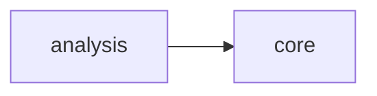

# Src Orion Analysis

[_Documentation generated by Documatic_](https://www.documatic.com)

<!---Documatic-section-Codebase Structure-start--->
## Codebase Structure

<!---Documatic-block-system_architecture-start--->

<!---Documatic-block-system_architecture-end--->

# #
<!---Documatic-section-Codebase Structure-end--->

<!---Documatic-section-src.orion.analysis.base.flatten_numpy-start--->
## [src.orion.analysis.base.flatten_numpy](7-src_orion_analysis.md#src.orion.analysis.base.flatten_numpy)

<!---Documatic-section-flatten_numpy-start--->
<!---Documatic-block-src.orion.analysis.base.flatten_numpy-start--->
<details>
	<summary><code>src.orion.analysis.base.flatten_numpy</code> code snippet</summary>

```python
def flatten_numpy(trials_array, flattened_space):
    flattened_points = numpy.array([format_trials.trial_to_tuple(flattened_space.transform(format_trials.tuple_to_trial(point[:-1], flattened_space.original)), flattened_space) for point in trials_array])
    return numpy.concatenate((flattened_points, trials_array[:, -1:]), axis=1)
```
</details>
<!---Documatic-block-src.orion.analysis.base.flatten_numpy-end--->
<!---Documatic-section-flatten_numpy-end--->

# #
<!---Documatic-section-src.orion.analysis.base.flatten_numpy-end--->

<!---Documatic-section-src.orion.analysis.base.to_numpy-start--->
## [src.orion.analysis.base.to_numpy](7-src_orion_analysis.md#src.orion.analysis.base.to_numpy)

<!---Documatic-section-to_numpy-start--->
<!---Documatic-block-src.orion.analysis.base.to_numpy-start--->
<details>
	<summary><code>src.orion.analysis.base.to_numpy</code> code snippet</summary>

```python
def to_numpy(trials, space):
    return trials[list(space.keys()) + ['objective']].to_numpy()
```
</details>
<!---Documatic-block-src.orion.analysis.base.to_numpy-end--->
<!---Documatic-section-to_numpy-end--->

# #
<!---Documatic-section-src.orion.analysis.base.to_numpy-end--->

<!---Documatic-section-src.orion.analysis.base.train_regressor-start--->
## [src.orion.analysis.base.train_regressor](7-src_orion_analysis.md#src.orion.analysis.base.train_regressor)

<!---Documatic-section-train_regressor-start--->
<!---Documatic-block-src.orion.analysis.base.train_regressor-start--->
<details>
	<summary><code>src.orion.analysis.base.train_regressor</code> code snippet</summary>

```python
def train_regressor(regressor_name, data, **kwargs):
    if regressor_name not in _regressors_:
        raise ValueError(f'{regressor_name} is not a supported regressor. Did you mean any of thesis: list(_regressors_.keys())')
    regressor = _regressors_[regressor_name](**kwargs)
    return regressor.fit(data[:, :-1], data[:, -1])
```
</details>
<!---Documatic-block-src.orion.analysis.base.train_regressor-end--->
<!---Documatic-section-train_regressor-end--->

# #
<!---Documatic-section-src.orion.analysis.base.train_regressor-end--->

[_Documentation generated by Documatic_](https://www.documatic.com)