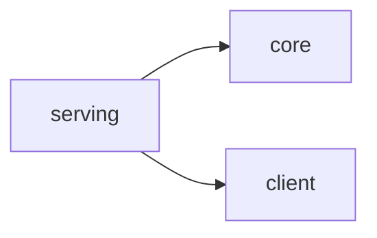
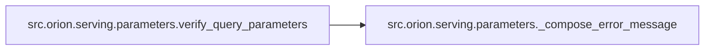

# Src Orion Serving

[_Documentation generated by Documatic_](https://www.documatic.com)

<!---Documatic-section-Codebase Structure-start--->
## Codebase Structure

<!---Documatic-block-system_architecture-start--->

<!---Documatic-block-system_architecture-end--->

# #
<!---Documatic-section-Codebase Structure-end--->

<!---Documatic-section-src.orion.serving.parameters.retrieve_experiment-start--->
## [src.orion.serving.parameters.retrieve_experiment](8-src_orion_serving.md#src.orion.serving.parameters.retrieve_experiment)

<!---Documatic-section-retrieve_experiment-start--->
<!---Documatic-block-src.orion.serving.parameters.retrieve_experiment-start--->
<details>
	<summary><code>src.orion.serving.parameters.retrieve_experiment</code> code snippet</summary>

```python
def retrieve_experiment(storage, experiment_name: str, version: int=None) -> Optional[Experiment]:
    try:
        experiment = experiment_builder.load(experiment_name, version, storage=storage)
        if version and experiment.version != version:
            raise falcon.HTTPNotFound(title=ERROR_EXPERIMENT_NOT_FOUND, description=f'Experiment "{experiment_name}" has no version "{version}"')
        return experiment
    except NoConfigurationError:
        raise falcon.HTTPNotFound(title=ERROR_EXPERIMENT_NOT_FOUND, description=f'Experiment "{experiment_name}" does not exist')
```
</details>
<!---Documatic-block-src.orion.serving.parameters.retrieve_experiment-end--->
<!---Documatic-section-retrieve_experiment-end--->

# #
<!---Documatic-section-src.orion.serving.parameters.retrieve_experiment-end--->

<!---Documatic-section-src.orion.serving.parameters.verify_query_parameters-start--->
## [src.orion.serving.parameters.verify_query_parameters](8-src_orion_serving.md#src.orion.serving.parameters.verify_query_parameters)

<!---Documatic-section-verify_query_parameters-start--->


### Object Calls

* [src.orion.serving.parameters._compose_error_message](8-src_orion_serving.md#src.orion.serving.parameters._compose_error_message)

<!---Documatic-block-src.orion.serving.parameters.verify_query_parameters-start--->
<details>
	<summary><code>src.orion.serving.parameters.verify_query_parameters</code> code snippet</summary>

```python
def verify_query_parameters(parameters: dict, supported_parameters: list):
    for parameter in parameters:
        if parameter not in supported_parameters:
            description = _compose_error_message(parameter, supported_parameters)
            raise falcon.HTTPBadRequest(ERROR_INVALID_PARAMETER, description)
```
</details>
<!---Documatic-block-src.orion.serving.parameters.verify_query_parameters-end--->
<!---Documatic-section-verify_query_parameters-end--->

# #
<!---Documatic-section-src.orion.serving.parameters.verify_query_parameters-end--->

<!---Documatic-section-src.orion.serving.parameters._compose_error_message-start--->
## [src.orion.serving.parameters._compose_error_message](8-src_orion_serving.md#src.orion.serving.parameters._compose_error_message)

<!---Documatic-section-_compose_error_message-start--->
<!---Documatic-block-src.orion.serving.parameters._compose_error_message-start--->
<details>
	<summary><code>src.orion.serving.parameters._compose_error_message</code> code snippet</summary>

```python
def _compose_error_message(key: str, supported_parameters: list):
    error_message = f'Parameter "{key}" is not supported. Expected '
    if len(supported_parameters) > 1:
        supported_parameters.sort()
        error_message += f'one of {supported_parameters}.'
    else:
        error_message += f'parameter "{supported_parameters[0]}".'
    return error_message
```
</details>
<!---Documatic-block-src.orion.serving.parameters._compose_error_message-end--->
<!---Documatic-section-_compose_error_message-end--->

# #
<!---Documatic-section-src.orion.serving.parameters._compose_error_message-end--->

[_Documentation generated by Documatic_](https://www.documatic.com)